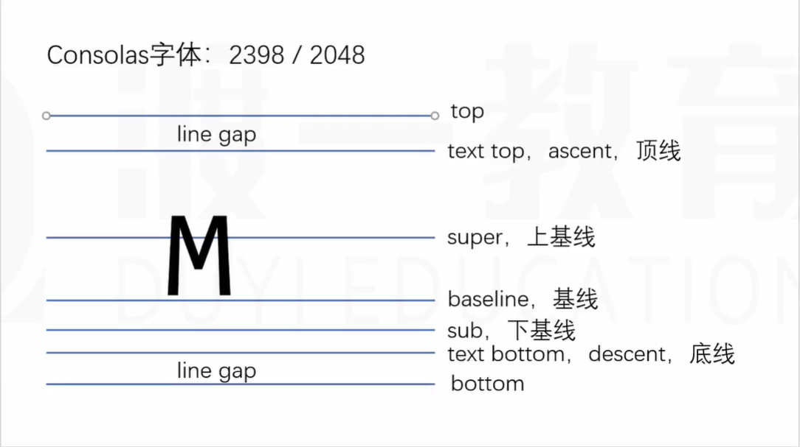

# 参考线-深入理解字体

font-size、line-height、vertical-align、font-family

## 文字

文字是通过一些文字制作软件制作的，比如 fontforge

制作文字时，会有几根参考线，不同的文字类型，参考线不一样。同一种文字类型，参考线一致。

从上到下五根参考线

## font-size

字体大小，设置的是文字的相对大小。

文字的相对大小：1000、2048、1024

文字顶线到底线的距离，是文字的实际大小（content-area，内容区）

行盒的背景，覆盖 content-area

## 行高

顶线向上延伸的空间，和底线向下延伸的空间，两个空间相等，该空间叫做 gap（空隙）

gap 默认情况下，是字体设计者决定

top 到 bottom，叫做 virtual-area（虚拟区）

行高，就是 virtual-area

line-height：normal，使用文字默认的 gap

> 文字一定出现在一行的最中间——错误
> content-area 一定出现在 virtual-area 的正中间

## vertical-align

决定参考线：font-size、font-family、line-height

一个元素如果子元素出现行盒，该元素内部也会产生参考线

baseline：该元素的基线与父元素的基线对齐

super：该元素的基线与父元素的上基线对齐

sub：该元素的基线与父元素的下基线对齐

text-top：该元素的 virtual-area 的顶边，对齐父元素的 text-top

text-bottom：该元素的 virtual-area 的底边，对齐父元素的 text-bottom

top：该元素的 virtual-area 的顶边，对齐 line-box 的顶边

bottom：该元素的 virtual-area 的底边，对齐 line-box 的底边

middle：该元素的中线（content-area 的一半），与父元素的 X 字母高度一半的位置对齐

行盒组合起来，可以形成多行，每一行的区域叫做 line-box，line-box 的顶边是该行内所有行盒最高顶边，底边是该行内所有行盒最低底边

实际，一个元素的实际占用高度（高度自动），高度的计算通过 line-box 计算。

行盒：inline-box
行框：line-box

数值：相对于基线的偏移量，向上为正数，向下为负数。

百分比：相对于基线的偏移量，百分比是相对于自身的 virtual-area 的高度。

line-box 是承载文字内容的必要条件，以下情况不生成行框：

1. 某元素内部没有任何行盒
2. 某元素字体大小为 0

## 可替换元素和行块盒

图片：基线位置位于图片的下外边距。

表单元素：基线位置在内容底边

行块盒

1. 行块盒最后一行有 line-box，用最后一行的基线作为整个行块盒的基线。
2. 如果行块盒内部没有行盒，则使用下外边距作为基线
